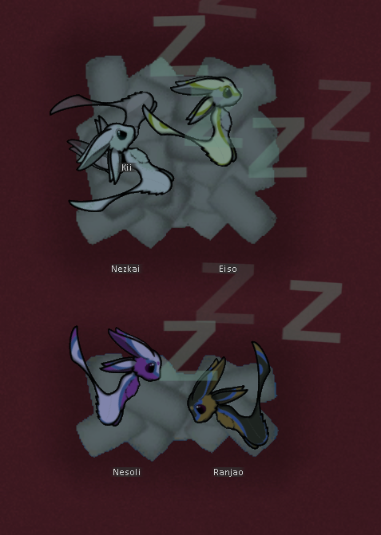

# RimWorld 2D Beds
A patch that allows 2D beds in RimWorld. Made for [RimVali: Far From Avalon](https://steamcommunity.com/sharedfiles/filedetails/?id=2180380125) but anything can easily be added by changing the list of defNames in `HarmonyPatches.Is2DBed(string defName)`. Each tile the bed covers will be a valid sleeping spot. Pawns will also have random positioning and placement when usng them (angles may break when Vanilla Expanded Framework is active but positions should be fine and it is easy to remove this feature entirely or just the angles. This issue will hopefully be fixed in an upcoming patch for that mod).  

